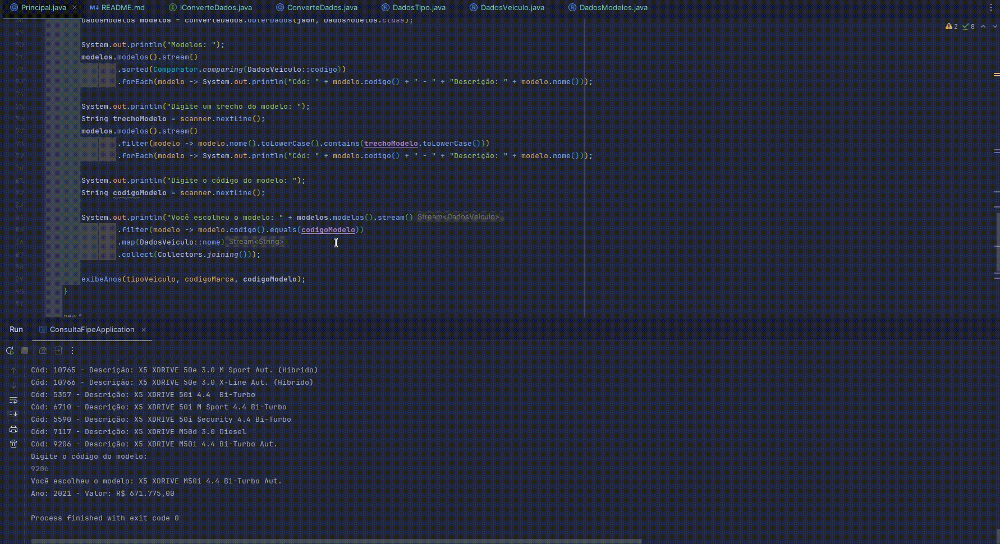

# Projeto Consulta Tabela FIPE

## Descrição
Esse Projeto faz parte da trilha de aprendizado proposta 
pela Alura em parceria com a Oracle. O objetivo é criar um programa que verifica o valor do veículo 
conforme a tabela FIPE.
## Tecnologias
- Java 17
- Maven
- Spring 

## Dependências
- Jackson

## Demo

## API
A API utilizada para fazer a conversão das moedas é a [https://deividfortuna.github.io/fipe/](https://deividfortuna.github.io/fipe/)

## Como rodar o projeto
Para rodar o projeto, basta clonar o repositório e abrir o 
projeto em uma IDE que suporte Java. 
Em seguida, basta rodar a classe `Principal` que está localizada no pacote `br.com.jsergio.ConsultaFipe.principal`.

## Autor
- José Sergio Pinto da silva

Linkedin: [José Sergio Pinto da Silva](www.linkedin.com/in/josésérgiopsilva)
